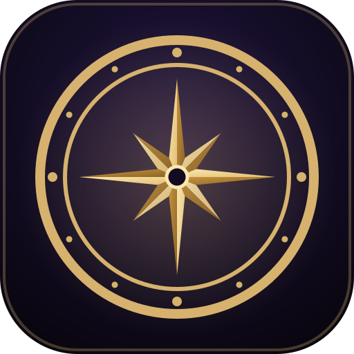

<div align="center">
  
  <h1>Peace Oracle</h1>
  <p>Zodiak, Shio, Weton, dan Tarot dalam satu app.</p>

  <p>
    
    
    
    
    
  </p>
</div>

Peace Oracle lahir dari ide simpel: kenapa harus buka banyak situs cuma buat cek ramalan dari tradisi yang beda-beda? Jadi semuanya kami kumpulin di satu tempat. Sekarang sudah ada Zodiak, Shio, Weton, dan Tarot.

UI desktop dan mobile dibangun terpisah, bukan versi desktop yang dipaksa responsif. Hasilnya, di HP rasanya kayak pakai native app.

## Fitur

**Zodiak**
- Ramalan harian yang di-generate AI via OpenRouter. Kalau kuota harian habis, otomatis fallback ke bank ramalan yang sudah disiapkan.
- Profil karakter tiap zodiak.
- Cek kecocokan buat asmara, sahabat, atau rekan kerja. Ada Quiz Room juga buat main berdua, hasilnya di-review AI.
- Roasting, solo atau bareng pasangan. Kurang pedas? Tinggal reroll.

**Shio**
- Ming Li: baca Empat Pilar Ba Zi (八字) dari tanggal, jam, dan kota lahir.
- Tong Shu: almanak harian, 12 dewa harian, plus ranking shio hari ini.
- Liu Nian: forecast energi tahunan per shio.
- Pei Dui: cek kecocokan dua orang, bisa pilih mode asmara, pertemanan, atau kerja.
- Tu Cao: roasting per shio, solo atau berdua.
- Ben Ming Fo: figur pelindung, mantra, dan tips Feng Shui.
- Xing Yun Bing: fortune cookie harian.
- Ju Hui: kuis bareng teman (ramalan pasangan, ramalan grup, dan tebak shio teman).

**Weton**
- Kartu "Hari ini" di halaman depan: weton, tanggal Jawa, wuku, dan mangsa hari ini, lengkap dengan info kapan harinya ganti pas maghrib dan hari istimewa terdekat.
- Cek weton lahir: neptu, wuku lengkap dengan lambang kayu dan burungnya, tanggal Jawa, pranata mangsa plus tanda alamnya, watak, sampai gaya kerja. Lahir setelah maghrib? Hari wetonnya otomatis geser ke hari berikutnya, dihitung sesuai kota lahir.
- Kecocokan weton pakai empat metode petung sekaligus (sisa bagi 8, 5, 4, dan 7).
- Kalender Jawa: weton harian, hari istimewa (termasuk Garebeg keraton dan Rebo Wekasan), hari pantangan, dan reminder wetonan.
- Roasting berdasarkan hari, pasaran, dan neptu.
- Cari hari baik buat nikah, pindah rumah, bangun rumah, buka usaha, atau transaksi besar. Hari pantangan disaring, sasi nikah dan petung Pancasuda ikut dihitung, lengkap dengan alasan dan sumbernya.

**Tarot**
- Kartu harian: satu kartu per perangkat per hari, tetap sama sampai besok, lengkap dengan makna umum, cinta, karier, dan keuangan.
- Bacaan tarot: pilih topik dan spread (satu kartu, Lalu-Kini-Nanti, Situasi-Tindakan-Hasil, atau Celtic Cross versi Waite), lalu ambil sendiri kartunya dari 78 kartu tertutup. Dek dikocok ulang di server tiap bacaan. Kalau kamu nulis pertanyaan, kartunya langsung menjawab pertanyaan itu, mau soal karier sampai "hari ini makan apa?".
- Sintesis bacaan dihitung dari pola kartunya: dominasi Arcana Mayor, suit yang paling banyak atau absen, angka yang berulang, kartu istana, proporsi kartu terbalik, plus relasi antar posisi di Celtic Cross.
- Jawaban pertanyaan dirangkum AI via OpenRouter dari kartu yang keluar. Kalau AI lagi down atau jatah harian habis, jawabannya tetap keluar dari bank jawaban yang membaca kata tanya (siapa, kapan, di mana, kenapa, gimana, berapa) dan elemen kartunya.
- Ya atau tidak: satu kartu untuk pertanyaan tertutup. Vonisnya ditetapkan per kartu dan per orientasi, lalu dijelaskan sesuai pertanyaanmu.
- Bacaan hubungan: tujuh posisi buat kamu, dia, kebutuhan masing-masing, tantangan, dan arah hubungan.
- Kartu lahir: kartu kepribadian, kartu jiwa, dan kartu tahunan dengan metode Mary K. Greer, lengkap dengan langkah hitungnya.
- Ensiklopedia 78 kartu: simbol Rider-Waite, korespondensi astrologi dan huruf Ibrani versi Golden Dawn, serta makna tegak dan terbalik per topik.
- Kartu terbalik bisa dimatikan. Dek default-nya scan asli Rider-Waite 1909. Khusus 1 April (April Mop), semua kartu berganti ke Oracolo, dek SVG buatan sendiri, dan bisa dikembalikan ke Rider-Waite lewat pemilih dek.

Di landing page ada floating button buat switch mode, plus beberapa easter egg kecil. Good luck nyarinya.

## Arsitektur

Tiap sistem ramalan jadi Flask Blueprint sendiri di `modules/`. Semua modul cuma depend ke `core/` dan nggak saling import, jadi satu modul bisa dicabut tanpa bikin yang lain rusak. Navigasi dan landing page otomatis nyesuain modul yang ter-install.

AI dipakai di Zodiak dan untuk menjawab pertanyaan di Tarot. Shio, Weton, dan sisa fitur Tarot full dihitung di server pakai data dan rumus sendiri, zero API call.

MySQL dipakai buat nyimpen kuota AI dan room kuis. Kuota AI Zodiak dan Tarot pakai mekanisme yang sama di `core/`: batas per perangkat, per jaringan, dan batas total harian per modul biar kredit AI nggak jebol. Kalau database lagi down, app tetap jalan: kuota pindah ke in-memory store, sementara Quiz Room nonaktif sampai database balik lagi. Semua tabel (`ai_usage`, `zodiak_rooms`, `shio_rooms`, `shio_room_participants`) dibuat otomatis saat pertama kali dibutuhkan, jadi cukup siapin database kosong.

```text
peace-oracle/
├── app.py            # entry point, register blueprint
├── core/             # core.py, base template, landing page, shared assets
├── modules/
│   ├── zodiak/
│   ├── shio/
│   ├── weton/
│   └── tarot/
├── api/index.py      # entry point Vercel
├── vercel.json
└── .python-version
```

## Setup lokal

Pastikan Python kamu minimal 3.12.

```bash
git clone https://github.com/dikigambol/peace-oracle.git
cd peace-oracle

python -m venv venv
source venv/bin/activate        # Linux / Mac
source venv/Scripts/activate    # Windows (Git Bash)
venv\Scripts\activate           # Windows (CMD / PowerShell)

pip install -r requirements.txt
cp .env.example .env
```

Lalu isi `.env`. Yang penting:

| Variabel | Keterangan |
| --- | --- |
| `SECRET_KEY` | Wajib. Generate pakai `python -c "import secrets; print(secrets.token_hex(32))"` |
| `OPENROUTER_KEY` | Buat ramalan dan review AI di Zodiak, plus jawaban pertanyaan di Tarot (Bacaan dan Ya/Tidak) |
| `MYSQL_HOST`, `MYSQL_DB`, `MYSQL_USER`, `MYSQL_PASSWORD` | Koneksi database. Kalau kosong, Quiz Room nggak aktif |
| `FLASK_ENV` | Set `production` di server biar debug mode selalu off |

Sisanya opsional dan sudah ada default-nya: `FLASK_DEBUG`, `FLASK_HOST`, `FLASK_PORT` (5000), `MYSQL_PORT` (3306), `DAILY_AI_LIMIT` (10), `FINGERPRINT_AI_LIMIT` (30), `DAILY_AI_BUDGET` (300), `TAROT_AI_LIMIT` (10), `TAROT_FINGERPRINT_AI_LIMIT` (30), `TAROT_AI_BUDGET` (300), `DB_OFFLINE_COOLDOWN` (60 detik), `MEMORY_STORE_MAX` (5000).

Terus run:

```bash
python app.py
```

Buka `http://127.0.0.1:5000/` dan selesai.

## Deploy ke Vercel

Connect repo ke [Vercel](https://vercel.com), copy semua environment variable dari `.env`, lalu deploy. Config-nya sudah siap di `vercel.json`, nggak perlu setting tambahan.

Sebagai pengaman terakhir, set credit limit di API key OpenRouter (dashboard OpenRouter, menu Keys). Jadi walaupun ada yang kebobolan di sisi app, tagihannya tetap mentok di angka itu.

## Hak cipta

© 2026 Peace Oracle. All rights reserved.

Repo ini public supaya kodenya bisa dibaca dan dipelajari, tapi **bukan open source**. Menyalin, memodifikasi, mendistribusikan, atau menayangkan ulang sebagian maupun seluruhnya wajib dapat izin tertulis dari pemilik.

Aset ikon di mode Shio dibuat dengan bantuan generative AI.

Gambar dek Rider-Waite di mode Tarot adalah ilustrasi Pamela Colman Smith untuk dek yang terbit pertama kali tahun 1909. Scan-nya berasal dari cetakan awal bertanggal 1910, berstatus domain publik, dan diambil dari [Wikimedia Commons](https://commons.wikimedia.org/wiki/Category:Rider-Waite-Smith_tarot_deck_(TaionWC)). Gambar tersebut nggak termasuk dalam pembatasan hak cipta di atas. Makna kartu disusun ulang dari A. E. Waite, *The Pictorial Key to the Tarot* (1910), korespondensi Golden Dawn, dan metode kartu lahir Mary K. Greer.

Data kota kelahiran untuk Shio dan Weton (nama, bujur, lintang, zona waktu) diambil dari [GeoNames](https://www.geonames.org/) di bawah lisensi [CC BY 4.0](https://creativecommons.org/licenses/by/4.0/) pada 18 September 2026 (data lintang untuk Weton pada 25 September 2026). Data tersebut tetap milik GeoNames dan nggak termasuk dalam pembatasan hak cipta di atas.

---

<div align="center">
  <sub>Built with overthinking tengah malam dan sedikit dorongan dari Merkurius Retrograde.</sub>
</div>
